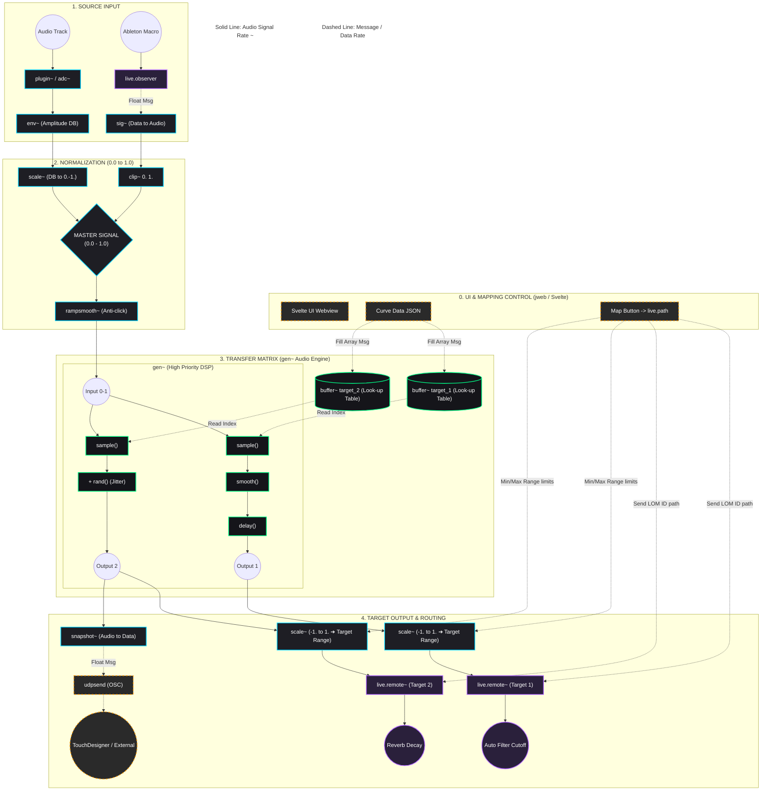

```mermaid
graph TD
    %% 스타일 정의
    classDef ui fill:#2A2A2A,stroke:#FF9900,stroke-width:2px,color:#FFF,stroke-dasharray: 5 5
    classDef msp fill:#1E1E24,stroke:#00D2FF,stroke-width:2px,color:#FFF
    classDef gen fill:#15151A,stroke:#00FF88,stroke-width:2px,color:#FFF
    classDef lom fill:#2A203B,stroke:#B066FF,stroke-width:2px,color:#FFF

    %% --------------------------------------------------
    %% 0. UI & MAPPING LAYER (Message Rate)
    %% --------------------------------------------------
    subgraph UI_Layer ["0. UI & MAPPING CONTROL (jweb / Svelte)"]
        direction LR
        Svelte[Svelte UI Webview]:::ui
        CurveJSON[Curve Data JSON]:::ui
        MapLogic[Map Button -> live.path]:::ui
    end

    %% --------------------------------------------------
    %% 1. SOURCE INPUT (Audio / LOM)
    %% --------------------------------------------------
    subgraph Input_Layer ["1. SOURCE INPUT"]
        direction TB
        AudioSrc((Audio Track)) --> Plugin["plugin~ / adc~"]:::msp
        Plugin --> Env["env~ (Amplitude DB)"]:::msp
        
        MacroSrc((Ableton Macro)) --> Observer["live.observer"]:::lom
        Observer -.->|Float Msg| SigGen["sig~ (Data to Audio)"]:::msp
    end

    %% --------------------------------------------------
    %% 2. NORMALIZATION (0.0 to 1.0)
    %% --------------------------------------------------
    subgraph Norm_Layer ["2. NORMALIZATION (0.0 to 1.0)"]
        direction TB
        Env --> Scale1["scale~ (DB to 0.-1.)"]:::msp
        SigGen --> Clip["clip~ 0. 1."]:::msp
        
        Scale1 --> MasterSig{"MASTER SIGNAL\n(0.0 - 1.0)"}:::msp
        Clip --> MasterSig
        
        MasterSig --> SmoothBase["rampsmooth~ (Anti-click)"]:::msp
    end

    %% --------------------------------------------------
    %% 3. TRANSFER MATRIX (gen~ & buffer~)
    %% --------------------------------------------------
    subgraph Matrix_Layer ["3. TRANSFER MATRIX (gen~ Audio Engine)"]
        direction TB
        
        Buf1[("buffer~ target_1 (Look-up Table)")]:::gen
        Buf2[("buffer~ target_2 (Look-up Table)")]:::gen
        
        CurveJSON -.->|Fill Array Msg| Buf1
        CurveJSON -.->|Fill Array Msg| Buf2
        
        subgraph Gen_Core ["gen~ (High Priority DSP)"]
            direction TB
            InputSig((Input 0-1))
            
            InputSig --> Sample1["sample()"]:::gen
            Sample1 --> MathSmooth["smooth()"]:::gen
            MathSmooth --> MathDelay["delay()"]:::gen
            MathDelay --> Out1((Output 1))
            
            InputSig --> Sample2["sample()"]:::gen
            Sample2 --> MathJitter["+ rand() (Jitter)"]:::gen
            MathJitter --> Out2((Output 2))
        end
        
        Buf1 -.->|Read Index| Sample1
        Buf2 -.->|Read Index| Sample2
        
        SmoothBase --> InputSig
    end

    %% --------------------------------------------------
    %% 4. TARGET OUTPUT
    %% --------------------------------------------------
    subgraph Output_Layer ["4. TARGET OUTPUT & ROUTING"]
        direction TB
        
        Out1 --> TargetScale1["scale~ (-1. to 1. ➔ Target Range)"]:::msp
        TargetScale1 --> Remote1["live.remote~ (Target 1)"]:::lom
        Remote1 --> AbletonParam1((Auto Filter Cutoff)):::lom
        
        Out2 --> TargetScale2["scale~ (-1. to 1. ➔ Target Range)"]:::msp
        TargetScale2 --> Remote2["live.remote~ (Target 2)"]:::lom
        Remote2 --> AbletonParam2((Reverb Decay)):::lom
        
        Out2 --> Snap["snapshot~ (Audio to Data)"]:::msp
        Snap -.->|Float Msg| OSCUDP["udpsend (OSC)"]:::ui
        OSCUDP -.-> TouchDesigner((TouchDesigner / External)):::ui
    end

    %% Mapping Connection Bridge
    MapLogic -.->|Send LOM ID path| Remote1
    MapLogic -.->|Send LOM ID path| Remote2
    MapLogic -.->|Min/Max Range limits| TargetScale1
    MapLogic -.->|Min/Max Range limits| TargetScale2

    %% 주석 및 범례
    classDef legend fill:none,stroke:none;
    Legend1[Solid Line: Audio Signal Rate ~]:::legend
    Legend2[Dashed Line: Message / Data Rate]:::legend
```